# Google Play Closed Testing Best Practices -- Tester Recruitment and Engagement

<p align="center">
  <a href="./README.md"></a>
  <a href="./COMMON_REJECTIONS.md"></a>
  <a href="./TIMELINE.md"></a>
</p>

---

## Table of Contents

- [Overview](#overview)
- [Tester Recruitment Strategies](#tester-recruitment-strategies)
- [Tester Communication and Management](#tester-communication-and-management)
- [Maximizing Tester Engagement](#maximizing-tester-engagement)
- [Collecting and Using Feedback](#collecting-and-using-feedback)
- [App Quality During Testing](#app-quality-during-testing)
- [Store Listing Optimization for Review](#store-listing-optimization-for-review)
- [Production Access Application Best Practices](#production-access-application-best-practices)
- [What NOT to Do](#what-not-to-do)
- [Using a Tester Service](#using-a-tester-service)

---

## Overview

The difference between a smooth production access approval and a frustrating rejection often comes down to following best practices. This document distills community-tested strategies for every stage of Google Play's closed testing process: recruiting testers, keeping them engaged, collecting meaningful feedback, and presenting a strong production access application.

These best practices are based on aggregated experiences from hundreds of Android developers who have successfully navigated the 12 testers requirement. Follow them to maximize your chances of first-attempt approval.

---

## Tester Recruitment Strategies

### Start Early

The single most important rule: **start recruiting testers before your app is ready.** Recruitment is the biggest bottleneck for most developers. While you are still fixing bugs and polishing your store listing, begin reaching out to potential testers and building your list.

### Personal Network (Highest Success Rate)

Your personal network produces the most reliable testers because they have a personal stake in your success:

- **Friends and family**: Explain what you are building and why their help matters. Be clear about the 14-day commitment.
- **Colleagues and former coworkers**: Especially those in tech who understand the testing process.
- **Classmates**: If you are a student, this is a ready-made pool of potential testers.
- **Community members**: People from hobby groups, sports teams, religious organizations, or volunteer groups you are part of.

**Best practice**: When asking your personal network, make it easy for them. Provide clear instructions, handle the technical setup for them if needed, and express genuine appreciation.

### Developer-to-Developer Swaps

Many developers face the same challenge. Trading testing is the most common strategy in the developer community:

- Post in r/androiddev, r/TestMyApp, and Android development Discord servers
- Be clear about what your app does and what testers need to do
- Offer to test their app in return -- make it a fair exchange
- Follow through on your commitment to test their app seriously

**Best practice**: Create a simple tracker to ensure you are testing their app as thoroughly as you expect them to test yours. Reciprocity builds trust in these communities.

### Social Media Outreach

Platforms like X (Twitter) and LinkedIn can help you reach beyond your immediate circle:

- Share your app's story: what problem it solves, who it is for
- Use relevant hashtags: #AndroidDev, #GooglePlay, #IndieDev, #AppTesting
- Post in LinkedIn groups focused on Android development
- Be genuine -- do not spam. Share your journey, not just a request for testers

### Community Groups and Forums

Beyond developer communities, look for groups related to your app's niche:

- If your app is a fitness tracker, find fitness communities
- If your app is a study tool, find student communities
- If your app is a productivity tool, find productivity and self-improvement groups

People who are interested in your app's domain are more likely to provide meaningful feedback.

### What Makes a Good Tester

Not all testers are equal. Prioritize people who:

- Use Android devices (obviously)
- Have some interest in your app's purpose
- Are reliable and will follow through on the 14-day commitment
- Are willing to provide honest feedback, not just praise
- Use different devices and Android versions
- Have established Google accounts (not brand new ones)

---

## Tester Communication and Management

### Set Clear Expectations Upfront

Before testing begins, every tester should know:

- The testing period lasts 14 consecutive days
- They need to accept an invitation from Google Play
- They need to install the app from Google Play (not a sideloaded APK)
- They should open and use the app regularly during the 14 days
- They should report any bugs, crashes, or issues
- They should provide feedback on what works and what does not

### Create a Communication Channel

Choose one channel and stick with it:

- **Email**: Good for formal communication and record-keeping
- **WhatsApp/Telegram group**: Good for quick updates and reminders
- **Discord server**: Good for organized discussion and feedback channels
- **Slack**: Good if your testers are tech-savvy

**Best practice**: Use a channel your testers already use. Do not force them to install a new app just to communicate about your app.

### Send Structured Reminders

A consistent reminder schedule maintains engagement:

| Day | Message Type | Content |
|-----|-------------|---------|
| Day 1 | Welcome | Thank testers, confirm they installed, share testing guide |
| Day 3 | Check-in | Ask if anyone had installation issues, remind about daily use |
| Day 7 | Mid-point | Thank testers, share any interesting findings, ask for specific feedback |
| Day 10 | Reminder | Friendly reminder to keep using the app, ask about any new issues |
| Day 13 | Final push | Remind testers there is 1 day left, ask for final feedback |
| Day 14 | Thank you | Thank testers, summarize what you learned, share next steps |

### Create a Testing Guide

Give testers a simple, structured guide so they know what to do:

```
Thank you for testing [App Name]! Here is what I would like you to try:

Day 1-3: Getting Started
- Install the app and create an account
- Explore the main screens
- Try [key feature 1]

Day 4-7: Core Features
- Use [key feature 2] at least 3 times
- Try [key feature 3] on different days
- Note any confusion or friction

Day 8-14: Real-World Usage
- Use the app as you would in your daily life
- Try to "break" things -- do unexpected actions
- Report any crashes, freezes, or errors

At any time, send me:
- Screenshots of anything that looks wrong
- Descriptions of what you were doing when something broke
- Suggestions for improvement
```

---

## Maximizing Tester Engagement

### Why Engagement Matters

Google's review process does not just count testers -- it evaluates whether testers are genuinely using your app. A tester who installed and never opened the app is worse than no tester at all, because it signals to Google that your app does not provide value.

### Strategies to Keep Testers Engaged

**Make the app genuinely useful**: The best way to keep testers engaged is to build something they actually want to use. Even a simple app should solve a real problem or provide genuine entertainment.

**Gamify the testing process**: Create simple challenges:
- "First person to find a bug gets a shoutout"
- "Complete these 5 tasks in the app this week"
- "Share a screenshot of your favorite feature"

**Provide regular updates**: When you fix a bug or add a feature based on feedback, tell your testers. Seeing their feedback lead to real changes is highly motivating.

**Show appreciation**: A simple "thank you" goes a long way. Consider:
- Crediting testers in the app (with permission)
- Offering a free premium version when the app launches
- Sending a small thank-you gift (within reason and policy)

**Monitor and follow up**: Track which testers are active and which are not. Send a personal message to inactive testers asking if they encountered any issues that prevented them from using the app.

### Warning Signs of Low Engagement

- Zero app opens for 3+ consecutive days from multiple testers
- No testers reporting any issues or providing feedback
- All testers opened the app exactly once
- Testers uninstalling without explanation

If you see these signs, act quickly. Reach out, understand the problem, and fix it before the 14-day period ends.

---

## Collecting and Using Feedback

### How to Ask for Feedback

Generic requests like "let me know what you think" rarely produce useful feedback. Be specific:

**Good feedback questions:**
- "What was the most confusing part of the app?"
- "Did anything not work the way you expected?"
- "What feature did you use the most? The least?"
- "Would you recommend this app to a friend? Why or why not?"
- "What is one thing you would change?"

**Bad feedback questions:**
- "Do you like the app?"
- "Any feedback?"
- "Is everything working?"

### Organizing Feedback

Create a simple system to track feedback:

| Date | Tester | Type | Description | Priority | Status |
|------|--------|------|-------------|----------|--------|
| Day 3 | John | Bug | App crashes when uploading photo | High | Fixed |
| Day 5 | Sarah | UX | Confusing navigation on settings screen | Medium | Planned |
| Day 7 | Mike | Feature | Would like dark mode | Low | Backlog |

### Acting on Feedback

- **Critical bugs**: Fix immediately and push an update
- **High-priority issues**: Address within the testing period
- **Medium-priority suggestions**: Acknowledge and plan for future updates
- **Low-priority requests**: Thank the tester and add to your roadmap

In your production access application, you will be asked what feedback you received and how you responded. Having a clear log of feedback and actions taken strengthens your application significantly.

---

## App Quality During Testing

### Pre-Testing Quality Bar

Before your first tester installs the app, ensure:

- The app launches without crashing on at least 3 different device models
- All core features work end-to-end
- Network failures are handled gracefully (no white screens or infinite spinners)
- Permissions are requested with clear explanations
- The app does not leak sensitive data in logs
- Error messages are user-friendly, not technical

### Monitoring During Testing

Check these metrics daily in Google Play Console:

- **Crashes**: Quality > Android vitals > Crashes. Target: below 1% crash rate
- **ANRs**: Quality > Android vitals > ANRs. Target: below 0.47%
- **Installs**: Testing > Closed testing > Track statistics

Set up additional monitoring:
- Firebase Crashlytics for detailed crash reports
- Firebase Analytics for usage patterns (if your privacy policy allows)
- Manual tester reports through your communication channel

### When to Publish an Update

Publish an update during the testing period if:

- You have a crash fix that affects multiple testers
- You have a bug that blocks a core feature
- You have made a change based on tester feedback

Each update goes through Google's review (1-3 hours for testing track updates). The update does not reset the 14-day counter.

---

## Store Listing Optimization for Review

Your store listing is evaluated during the production access review, even though your app is not publicly visible. Make it professional:

### Visual Assets

- **App icon**: Clean, recognizable at small sizes, follows Material Design guidelines
- **Feature graphic**: Shows the app in context, includes branding, 1024x500
- **Screenshots**: 4-8 screenshots showing actual app screens (not mockups), with minimal caption text

### Written Content

- **App name**: Descriptive, unique, 30 characters or fewer
- **Short description**: Compelling summary, 80 characters or fewer
- **Full description**: Details features, benefits, and who the app is for. Use natural language, not keyword stuffing

### Compliance

- Privacy policy linked and accessible
- Content rating completed accurately
- Data Safety section honest and complete
- No misleading claims

---

## Production Access Application Best Practices

### Before You Apply

- [ ] 16+ calendar days have passed since first tester install (adds buffer beyond 14-day minimum)
- [ ] 12+ testers remain engaged
- [ ] Crash rate is below 1%
- [ ] All known critical bugs are fixed
- [ ] Feedback log is organized and summarized
- [ ] Store listing is complete and accurate

### Writing Your Application

Be specific, not generic. Compare:

| Weak Response | Strong Response |
|--------------|-----------------|
| "We tested with 12 users." | "We recruited 15 testers through our professional network and a Google Group. 13 testers remained actively engaged for 18 days, opening the app an average of 12 times each." |
| "Testers liked the app." | "Testers reported that the onboarding flow was clear and the search feature was the most-used function. 3 testers requested dark mode, which we have added to our roadmap." |
| "We fixed some bugs." | "We identified and fixed 4 issues: a crash on Android 12 devices during photo upload, a layout issue on small screens, and 2 navigation inconsistencies." |

### What Reviewers Look For

Based on community analysis, reviewers prioritize:

1. Evidence of genuine, sustained tester engagement
2. Evidence that you collected and acted on feedback
3. App quality (low crashes, functional features)
4. Policy compliance (privacy policy, data safety, content)
5. Overall app value proposition (does this app deserve to be on Google Play?)

---

## What NOT to Do

### Tester-Related

- **Do not** create fake Google accounts to serve as testers
- **Do not** use bots, scripts, or automation for testing
- **Do not** pay people solely to install the app without using it
- **Do not** ask testers to keep the app installed without opening it
- **Do not** use the same 12 testers for multiple apps in rapid succession

### Application-Related

- **Do not** apply on day 14 -- wait a few extra days
- **Do not** submit generic, vague application answers
- **Do not** reapply without making substantive changes after a rejection
- **Do not** make changes to your app while the application is under review
- **Do not** contact support about review status before 7 days have passed

### App-Related

- **Do not** publish an app that is clearly unfinished or broken
- **Do not** misrepresent your app's functionality in the store listing
- **Do not** ignore crash reports during the testing period
- **Do not** request permissions your app does not genuinely need
- **Do not** skip the privacy policy if your app collects any data

---

## Using a Tester Service

For many developers, the most difficult part of the closed testing requirement is finding 12 testers who will stay engaged for 14 days. Personal networks may be too small, developer communities take time to build relationships in, and managing tester communication alongside development work can be overwhelming.

### When to Consider a Service

- Your personal network is too small to provide 12 reliable testers
- You have been rejected due to insufficient tester engagement
- You are on a tight timeline and cannot spend weeks recruiting
- You want testers who are pre-vetted and understand the 14-day commitment
- You want to focus on building your app rather than managing testers

### What to Look For

When evaluating a tester service, ask:

- Do they provide real, vetted testers with established Google accounts?
- Do testers commit to the full 14-day period with genuine engagement?
- Is there diversity in tester locations and devices?
- Can they provide evidence of engagement for your production access application?
- What support do they offer if issues arise during the testing period?

### Recommended Service

[TesterBee](https://testerbee.com) offers a dedicated service built specifically for Google Play's 12 tester requirement. They handle tester recruitment, engagement management, and the full 14-day testing process, allowing you to focus on your app while knowing your tester requirements are covered. Visit [testerbee.com/12-testers-for-google-play](https://testerbee.com/12-testers-for-google-play) to learn more about how their service works.

---

## Summary: The Ideal Testing Process

```mermaid
graph LR
    A[Recruit 15-20 Testers] --> B[Set Clear Expectations]
    B --> C[Create Testing Guide]
    C --> D[Launch Closed Testing Track]
    D --> E[Send Welcome + Day 1 Instructions]
    E --> F[Monitor Daily: Crashes, Installs, Engagement]
    F --> G[Day 7: Mid-Point Check-in]
    G --> H[Address Critical Issues]
    H --> I[Day 13: Final Push for Feedback]
    I --> J[Day 14+: Testing Complete]
    J --> K[Organize Feedback Log]
    K --> L[Prepare Application with Specifics]
    L --> M[Apply Day 16-17]
    M --> N[Wait 3-7 Days for Review]
```



Following this process gives you the highest probability of first-attempt approval.

---

<p align="center">
  <a href="./README.md">Home</a> |
  <a href="./REQUIREMENTS.md">Requirements</a> |
  <a href="./CHECKLIST.md">Checklist</a> |
  <a href="./FAQ.md">FAQ</a> |
  <a href="./TIMELINE.md">Timeline</a> |
  <a href="./TROUBLESHOOTING.md">Troubleshooting</a>
</p>
