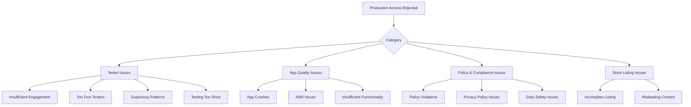

# Google Play Production Access Rejected -- Common Reasons and Solutions

<p align="center">
  <a href="./README.md"></a>
  <a href="./FAQ.md"></a>
  <a href="./BEST_PRACTICES.md"></a>
</p>

---

## Table of Contents

- [Overview](#overview)
- [Rejection Reason Categories](#rejection-reason-categories)
- [Rejection 1: Insufficient Tester Engagement](#rejection-1-insufficient-tester-engagement)
- [Rejection 2: Testing Period Too Short](#rejection-2-testing-period-too-short)
- [Rejection 3: Too Few Testers](#rejection-3-too-few-testers)
- [Rejection 4: App Stability Issues](#rejection-4-app-stability-issues)
- [Rejection 5: Incomplete or Misleading Store Listing](#rejection-5-incomplete-or-misleading-store-listing)
- [Rejection 6: Policy Violations](#rejection-6-policy-violations)
- [Rejection 7: App Lacks Sufficient Functionality](#rejection-7-app-lacks-sufficient-functionality)
- [Rejection 8: Suspicious Tester Patterns](#rejection-8-suspicious-tester-patterns)
- [Rejection 9: Missing or Inadequate Privacy Policy](#rejection-9-missing-or-inadequate-privacy-policy)
- [Rejection 10: Data Safety Inaccuracies](#rejection-10-data-safety-inaccuracies)
- [How to Read a Rejection Message](#how-to-read-a-rejection-message)
- [Reapplication Strategy](#reapplication-strategy)
- [Real-World Rejection Experiences](#real-world-rejection-experiences)

---

## Overview

Receiving a "Production access rejected" message from Google Play can be frustrating, especially after spending weeks recruiting testers and running your closed testing phase. However, most rejections fall into a small number of categories, and nearly all of them are fixable.

This document catalogs the most common rejection reasons reported by the Android developer community, explains what each rejection actually means, and provides actionable solutions to get your application approved on the next attempt.

> **Important**: Google does not always provide detailed rejection reasons. The rejection message may be generic. The categories below are based on aggregated community reports and pattern analysis. Use them as a diagnostic framework rather than definitive explanations of your specific rejection.

---

## Rejection Reason Categories



---

## Rejection 1: Insufficient Tester Engagement

### What It Means

Google has determined that your testers did not meaningfully use your app during the 14-day period. Testers may have installed the app but never opened it, opened it once and abandoned it, or showed usage patterns that suggest automated or minimal interaction.

### Why It Happens

- Testers installed the app but never launched it after the initial install
- Testers opened the app once and never returned
- Usage patterns show no variation (e.g., all testers open the app at exactly the same time every day)
- Testers did not use core features of the app
- No testers provided feedback or reported any issues

### How to Fix It

1. **Communicate expectations clearly before testing begins**: Tell testers they need to use the app multiple times over 14 days, not just install it
2. **Send engagement reminders**: At day 1, day 7, and day 13, send messages reminding testers to open and use the app
3. **Guide testers on what to do**: Provide a simple list of features to try and actions to perform
4. **Ask for specific feedback**: Instead of "let me know if you find bugs," ask "can you try the login flow and tell me if it works smoothly?"
5. **Make the app worth using**: If your app provides no value, testers will not return to it. Even for testing, the app should do something useful
6. **Track engagement**: Monitor which testers are active and follow up with those who are not

### How to Present This in Your Reapplication

In your reapplication, describe:
- The specific engagement guidance you gave testers
- How you tracked and encouraged engagement
- Evidence of genuine usage (without violating tester privacy)
- Any feedback you received and how you responded to it

---

## Rejection 2: Testing Period Too Short

### What It Means

The 14 consecutive day minimum was not met, or Google's systems could not confirm that it was met.

### Why It Happens

- The testing track was live for less than 14 days before you applied
- Testers were not actively installed for the full 14 days (the clock may start from the first tester install, not track creation)
- The testing track was paused or recreated, breaking the consecutive period
- Reporting delays made it appear shorter than it was

### How to Fix It

1. Wait at least 16-17 calendar days from your first confirmed tester install before applying (adds a safety buffer)
2. Do not pause, remove, or recreate the closed testing track during the period
3. Verify the "Grow > Production access" dashboard shows the required duration as met
4. If the dashboard shows incomplete after 48+ hours of meeting requirements, contact Google Play support

### How to Prevent It

- Record the exact date and time your first tester installed and opened the app
- Count 14 full days from that date, then add 2-3 buffer days
- Do not apply on day 14 -- apply on day 16 or 17
- Take screenshots of the testing dashboard as evidence

---

## Rejection 3: Too Few Testers

### What It Means

Fewer than 12 testers met the engagement criteria throughout the 14-day period.

### Why It Happens

- You started with fewer than 12 testers (misunderstanding the minimum)
- Some testers dropped out (uninstalled) during the period
- Some testers never completed the opt-in process
- Some testers used email addresses that are not Google accounts
- Google did not count some testers (possibly due to account characteristics)

### How to Fix It

1. Recruit at least 15-20 testers to provide a buffer against dropouts
2. Monitor your tester count daily during the 14-day period
3. Have replacement testers ready to add if the count drops below 12
4. Verify all tester email addresses are valid Google accounts
5. Confirm every tester has accepted the invitation and installed the app

### How to Present This in Your Reapplication

Be transparent about your tester count. If you had dropouts, explain what you learned and how you ensured at least 12 engaged testers throughout a new testing period.

---

## Rejection 4: App Stability Issues

### What It Means

Your app had a high crash rate, excessive ANR (Application Not Responding) events, or other stability problems during the testing period.

### Why It Happens

- The app crashes on certain devices or Android versions
- The app freezes or becomes unresponsive (ANR)
- Memory leaks cause performance degradation
- Network-related crashes were not handled gracefully
- The app does not handle edge cases (e.g., missing permissions, no internet connection)

### How to Fix It

1. Check **Quality > Android vitals > Crashes** in Play Console
2. Check **Quality > Android vitals > ANRs** in Play Console
3. Fix all crashes with a crash rate above 0.1%
4. Target crash rate below 1% and ANR rate below 0.47%
5. Test on a variety of devices and Android versions before restarting closed testing
6. Use Firebase Crashlytics or a similar crash reporting tool for detailed diagnostics
7. Publish a stability update during your next testing period

### How to Present This in Your Reapplication

- List specific crashes that were identified and fixed
- Show before-and-after crash rate data
- Describe the testing you did on different devices
- Explain your ongoing monitoring strategy

---

## Rejection 5: Incomplete or Misleading Store Listing

### What It Means

Your app's store listing is missing required elements, contains inaccurate information, or misrepresents the app.

### Why It Happens

- Missing app icon, feature graphic, or screenshots
- Description does not match what the app actually does
- App name is misleading or impersonates another app
- Category is incorrect
- Required fields are empty or contain placeholder text
- Content rating questionnaire is incomplete

### How to Fix It

1. Verify every required field in your store listing is complete and accurate
2. Ensure screenshots represent the actual current version of the app
3. Write a description that accurately describes the app's functionality
4. Choose the most appropriate category and tags
5. Complete the content rating questionnaire fully and honestly
6. Have someone else review your listing for accuracy and completeness

> **Read next:** [REQUIREMENTS.md](./REQUIREMENTS.md) -- Complete store listing requirements checklist.

---

## Rejection 6: Policy Violations

### What It Means

Your app violates one or more Google Play Developer Policies, even during closed testing.

### Why It Happens

- The app contains prohibited content (hate speech, violence, illegal activities)
- The app impersonates another app, brand, or service
- The app uses deceptive behavior (hidden functionality, misleading claims)
- The app accesses user data without proper disclosure
- The app includes malicious code or behaviors
- The app violates intellectual property rights

### How to Fix It

1. Review the [Google Play Developer Policy Center](https://play.google.com/developer-content-policy/) thoroughly
2. Remove any policy-violating content, functionality, or behavior
3. If you were using a third-party SDK, check if it has been flagged
4. If the violation is unclear, review the specific policy cited in the rejection
5. Consider having a legal review if the violation involves intellectual property

### How to Present This in Your Reapplication

- Acknowledge the specific policy that was violated
- Describe exactly what you changed to achieve compliance
- Confirm that you have reviewed all policies and your app now complies

---

## Rejection 7: App Lacks Sufficient Functionality

### What It Means

Google's reviewers determined that your app does not provide enough value or functionality to justify publication. This is common with extremely simple apps, template-based apps, or apps that do little more than display a web view.

### Why It Happens

- The app is a "Hello World" or template app with no real features
- The app is essentially a wrapper around a website
- The app has only one or two very basic features
- The app appears to be a test app rather than a real product
- The app's functionality does not match what the description promises

### How to Fix It

1. Add meaningful features that provide real value to users
2. Ensure the app does more than display a web page
3. Implement at least 3-5 distinct features or screens
4. Make sure the app solves a real problem or provides genuine utility
5. Test the app yourself: would you use it? Would you recommend it?

### How to Present This in Your Reapplication

- Describe the app's core value proposition
- List specific features and what users can accomplish
- Explain why users would want to install and use this app
- If you added features since the last rejection, describe them

---

## Rejection 8: Suspicious Tester Patterns

### What It Means

Google's systems detected patterns in your tester data that suggest testers are not genuine. This could indicate automated installations, fake accounts, or coordinated behavior that looks artificial.

### Why It Happens

- All testers installed at nearly the same time
- All testers are from the same IP address range or geographic location
- All testers use the same device model
- Many testers installed and immediately uninstalled
- Testers never opened the app after installation
- Many tester accounts were created very recently
- The same testers appear across multiple developer accounts

### How to Fix It

1. Recruit testers from diverse sources and locations
2. Ensure testers are real individuals with established Google accounts
3. Stagger tester onboarding over a few days rather than all at once
4. Never use automated tools, scripts, or bots for testing
5. Never create Google accounts specifically to serve as testers
6. Encourage testers to use different devices and networks

For developers who struggle to recruit a diverse, engaged group of testers, [TesterBee](https://testerbee.com/12-testers-for-google-play) provides a service that delivers real, vetted testers who stay engaged for the full 14-day period -- helping avoid the suspicious patterns that trigger rejection.

> **Read next:** [BEST_PRACTICES.md](./BEST_PRACTICES.md) -- How to recruit genuine, diverse testers.

---

## Rejection 9: Missing or Inadequate Privacy Policy

### What It Means

Your privacy policy is missing, inaccessible, or does not adequately describe your data practices.

### Why It Happens

- No privacy policy URL provided in Play Console
- The privacy policy URL returns a 404 or error page
- The privacy policy is a generic template that does not describe your app's specific data practices
- The privacy policy does not include required information (data collected, usage, sharing, contact info)
- The privacy policy is not accessible from within the app (if the app collects data)

### How to Fix It

1. Create a privacy policy specific to your app (not a generic template)
2. Host it at a stable, publicly accessible URL
3. Include: what data you collect, why you collect it, how you use it, who you share it with, and how users can contact you
4. Test the URL from an incognito browser to ensure it is accessible
5. Add a link to the privacy policy within your app

---

## Rejection 10: Data Safety Inaccuracies

### What It Means

The Data Safety section of your Play Console listing does not accurately reflect your app's data practices.

### Why It Happens

- You declared that you collect no data, but your app uses analytics or third-party SDKs that do
- You did not declare data types that your app collects
- You declared data sharing practices that do not match reality
- Your Data Safety declarations contradict your privacy policy

### How to Fix It

1. Conduct a thorough audit of all data your app collects, including through third-party SDKs
2. Update the Data Safety section to accurately reflect all data collection and usage
3. Ensure consistency between your Data Safety declarations and privacy policy
4. If using analytics (Firebase, Google Analytics, etc.), declare it
5. If using advertising SDKs, declare it

---

## How to Read a Rejection Message

Google's rejection messages vary in detail. Here is how to interpret what you receive:

### Generic Rejection

```
Your application for production access has been rejected.
Please ensure you meet all requirements before applying again.
```

**What to do**: This provides no specific direction. Review every category in this document and verify compliance with each one.

### Specific Rejection

```
Your application has been rejected due to insufficient tester engagement.
Testers must actively use your app during the closed testing period.
```

**What to do**: This is actionable. Focus on the specific reason given (in this case, tester engagement) but also audit other areas to avoid a second rejection for a different reason.

### Multiple-Reason Rejection

```
Your application has been rejected for the following reasons:
- Insufficient tester engagement
- Incomplete store listing
```

**What to do**: Address all listed reasons. Do not fix only one and hope the others were minor.

---

## Reapplication Strategy

### Do Not Immediately Reapply

The most common mistake after rejection is reapplying too quickly without making meaningful changes. This leads to repeated rejections, which can harm your credibility.

### Steps for a Successful Reapplication

1. **Wait and assess**: Take at least 48 hours to review the rejection and plan your response
2. **Address every reason**: Even if the rejection cites only one issue, audit all areas
3. **Run another testing cycle if needed**: If tester engagement was the issue, run a new 14-day cycle with better engagement practices
4. **Document your changes**: Keep a list of every change you made
5. **Write a thorough reapplication**: In the application form, explicitly describe what was wrong and what you fixed
6. **Provide evidence**: If possible, include specific metrics or before-and-after comparisons

### Sample Reapplication Narrative

```
Since our previous application, we have made the following changes:

1. Tester Engagement: We established a communication channel with testers
   and sent weekly check-ins. Engagement improved from 2 opens/tester to
   8 opens/tester over the 14-day period.

2. App Stability: We fixed 3 crash issues identified during testing.
   Our crash rate decreased from 2.1% to 0.3%.

3. Store Listing: We updated our description to accurately reflect app
   functionality and added 4 new screenshots showing core features.
```

---

## Real-World Rejection Experiences

These anonymized experiences from the Android developer community illustrate common patterns:

### Case 1: The Engagement Gap

A developer recruited 15 friends as testers. All installed the app on day 1, but only 3 opened it more than once. The production access application was rejected for insufficient engagement.

**Solution**: The developer created a testing guide with 10 specific tasks for testers, sent daily reminders for the first 3 days, and used a group chat to collect feedback. The second attempt was approved.

### Case 2: The Rushed Application

A developer applied for production access on day 14, exactly 14 days after the first tester installed. The application was rejected because Google's systems had not yet registered the full 14 days.

**Solution**: The developer waited 3 additional days and reapplied. The application was approved without any other changes.

### Case 3: The Template App

A developer published a simple app with only a web view displaying their website. The production access application was rejected because the app lacked sufficient standalone functionality.

**Solution**: The developer added native features (push notifications, offline content, native navigation) and completed a new testing cycle. The second application was approved.

### Case 4: The Privacy Policy Gap

A developer's app used Firebase Analytics but the Data Safety section declared "No data collected." The production access application was rejected.

**Solution**: The developer updated the Data Safety section to accurately declare analytics data collection and updated their privacy policy. The reapplication was approved.

---

## Summary Checklist: Before Reapplying

- [ ] All previous rejection reasons addressed with specific actions
- [ ] 12+ testers with genuine engagement for 14+ consecutive days
- [ ] Crash rate below 1%, ANR rate below 0.47%
- [ ] Store listing complete and accurate
- [ ] Privacy policy accessible and comprehensive
- [ ] Data Safety section accurate and complete
- [ ] App provides meaningful functionality
- [ ] No policy violations
- [ ] Tester patterns appear natural and diverse
- [ ] Documentation of changes ready for reapplication narrative

---

<p align="center">
  <a href="./README.md">Home</a> |
  <a href="./REQUIREMENTS.md">Requirements</a> |
  <a href="./CHECKLIST.md">Checklist</a> |
  <a href="./FAQ.md">FAQ</a> |
  <a href="./TROUBLESHOOTING.md">Troubleshooting</a> |
  <a href="./BEST_PRACTICES.md">Best Practices</a>
</p>
