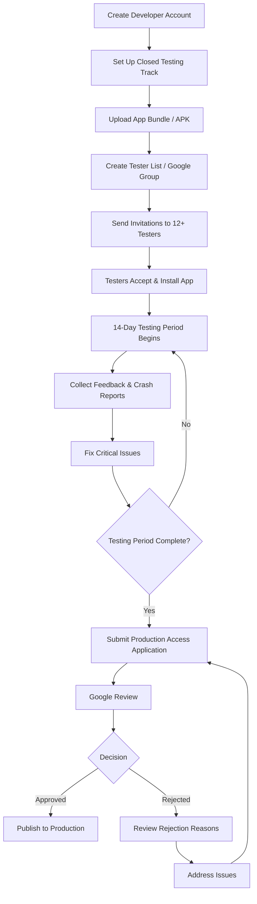

# 12 Testers for Google Play -- The Complete Closed Testing Guide

<p align="center">
  
</p>

<p align="center">
  <a href="https://github.com/12-testers/12-testers/blob/main/LICENSE"></a>
  <a href="#"></a>
  <a href="#"></a>
  <a href="#"></a>
  <a href="#"></a>
</p>

---

## Table of Contents

- [Overview](#overview)
- [What Is Google Play Closed Testing?](#what-is-google-play-closed-testing)
- [Why Google Requires 12 Testers](#why-google-requires-12-testers)
- [The 12 Testers Requirement in Detail](#the-12-testers-requirement-in-detail)
- [How the Closed Testing Process Works](#how-the-closed-testing-process-works)
- [Key Dates and Deadlines](#key-dates-and-deadlines)
- [Finding Your 12 Testers](#finding-your-12-testers)
- [Step-by-Step: Setting Up Closed Testing](#step-by-step-setting-up-closed-testing)
- [Step-by-Step: Applying for Production Access](#step-by-step-applying-for-production-access)
- [Common Mistakes That Cause Rejection](#common-mistakes-that-cause-rejection)
- [Repository Structure](#repository-structure)
- [Contributing](#contributing)
- [External Resources](#external-resources)

---

## Overview

Since November 2023, Google Play has required all **new personal developer accounts** to complete a **closed testing phase** before they can publish apps to production. This means you must recruit at least **12 testers**, have them test your app for a minimum of **14 consecutive days**, and then submit your app for production access review.

This repository is the most comprehensive open-source resource on the **Google Play 12 testers requirement**. Whether you are a solo developer publishing your first Android app, a startup preparing for launch, or an agency managing multiple client accounts, this documentation covers every step of the process.

**What you will find here:**

- A complete breakdown of Google Play's closed testing requirements
- A step-by-step production access checklist
- Common rejection reasons and how to avoid them
- Strategies for finding and managing 12 testers
- A day-by-day timeline for the 14-day testing period
- Best practices for tester engagement and feedback
- Troubleshooting guides for every stage

Start with this README, then work through each file in the repository to ensure you have everything covered before submitting your production access application.

> **Read next:** [REQUIREMENTS.md](./REQUIREMENTS.md) -- The official Google Play 12 testers requirement explained in detail.

---

## What Is Google Play Closed Testing?

Closed testing is a Google Play testing track that lets you distribute your app to a limited group of testers before publishing it to the public. Unlike internal testing (limited to 100 people within your organization) or open testing (visible to anyone on Google Play), closed testing sits in the middle: you control exactly who gets access, and your app is not discoverable through search.

### The Three Testing Tracks

| Track | Audience | Discoverable | Tester Limit | Production Requirement |
|-------|----------|-------------|-------------|----------------------|
| Internal Testing | Team members only | No | Up to 100 | No |
| Closed Testing (Alpha) | Invited testers only | No | Unlimited (invite-based) | **Yes (12 testers, 14 days)** |
| Open Testing (Beta) | Anyone on Google Play | Yes | Unlimited | No |
| Production | Public | Yes | Unlimited | N/A |

### Why Closed Testing Matters

Closed testing serves three purposes for Google:

1. **Quality Assurance**: Ensures developers test their apps with real users before reaching the public
2. **Fraud Prevention**: Reduces spam, malware, and low-quality apps on the Play Store
3. **User Trust**: Maintains the Play Store's reputation as a trusted app marketplace

For developers, closed testing is now a mandatory gate that every new personal account must pass through. Skipping it is not an option -- Google will reject your production access request if you have not met the testing requirements.

---

## Why Google Requires 12 Testers

The 12-tester minimum was introduced as part of Google's broader effort to improve app quality on the Play Store. Before this policy, developers could publish apps with little to no real-world testing, leading to an influx of broken apps, copycat software, and occasionally malicious applications.

### The Problem Google Was Solving

Prior to November 2023, new developer accounts could publish apps to production immediately after passing basic policy checks. This created several problems:

- **Low-quality apps** flooding categories and search results
- **Clone apps** repackaging existing apps with minor changes
- **Abandoned apps** that were published once and never updated
- **Malware and phishing apps** slipping through automated review

### How 12 Testers Addresses These Issues

By requiring **12 real people** to install and use an app for **14 consecutive days**, Google creates a meaningful barrier to entry that:

- Filters out developers unwilling to invest time in testing
- Generates real usage data that Google can analyze before production approval
- Provides crash reports and performance metrics before public release
- Creates a paper trail of tester feedback that supports the production access review

### Is 12 an Arbitrary Number?

Not entirely. Google selected 12 testers because:

1. It is large enough to provide statistically meaningful feedback
2. It is small enough to be achievable for solo developers and small teams
3. It aligns with standard beta testing group sizes in the software industry

The 14-day minimum similarly balances meaningful testing duration against practical constraints. Two weeks is enough to catch most critical bugs, stability issues, and UX problems without creating an unreasonable delay for developers.

---

## The 12 Testers Requirement in Detail

### Who Must Complete Closed Testing?

The closed testing requirement applies to:

- **New personal developer accounts** created on or after November 13, 2023
- **Personal accounts** that have never published an app to production before
- **Accounts** that had production access removed and are reapplying

The requirement does **not** apply to:

- **Organization accounts** (registered businesses with a D-U-N-S number)
- **Accounts that already have a published production app** (existing developers)
- **Apps published before** the November 2023 policy change

### What Counts as a Tester?

A tester in this context is a real Google account holder who:

- Accepts your closed testing invitation
- Installs your app from Google Play
- Uses the app (opens it at least once)
- Keeps the app installed (or reinstalls it regularly)
- Provides some form of engagement (optional but recommended)

Google does not publicly disclose the exact criteria it uses to validate testers, but based on community experience and rejection feedback, the following factors appear to matter:

| Factor | Importance | Notes |
|--------|-----------|-------|
| Tester opt-in | Critical | Testers must accept the invite via the Play Store link |
| App installation | Critical | The app must be installed and opened at least once |
| Installation duration | High | Testers should keep the app installed throughout the 14 days |
| Engagement | High | Periodic usage signals active testing |
| Feedback submission | Medium | Encouraged but not strictly required |
| Geographic diversity | Medium | Testers from different regions may strengthen your case |
| Account age | Low-Medium | Older Google accounts may carry more weight |

### The 14-Day Consecutive Period

The 14 days must be **consecutive**, not cumulative. If a tester uninstalls on day 7 and reinstalls on day 10, only the continuous stretch counts. This is why maintaining tester engagement throughout the entire period is critical.

The clock starts ticking from the moment your closed testing track goes live with testers installed, not from when you create the track or upload the build.

---

## How the Closed Testing Process Works



This flowchart captures the end-to-end process. Each stage has specific requirements and common pitfalls, which are covered in detail throughout this repository.

---

## Key Dates and Deadlines

| Milestone | Typical Duration | Notes |
|-----------|-----------------|-------|
| Account creation & verification | 1-2 days | Identity verification may take up to 48 hours |
| App preparation & testing track setup | 1-3 days | Depends on app complexity |
| Tester recruitment | 1 day - 4 weeks | The biggest variable -- plan ahead |
| 14-day closed testing | 14 days minimum | Cannot be shortened |
| Production access review | 3-7 days | Google's review window |
| Total (best case) | ~18 days | With testers ready on day 1 |
| Total (typical) | 4-6 weeks | Accounting for recruitment and fixes |

> **Read next:** [TIMELINE.md](./TIMELINE.md) -- A detailed day-by-day breakdown of the 14-day closed testing period.

---

## Finding Your 12 Testers

For many developers, finding 12 testers is the hardest part of the process. Here are the most effective strategies, ordered by reliability.

### Strategy 1: Personal Network

Your most reliable source. Reach out to:

- Friends and family willing to install and use your app
- Colleagues and former coworkers
- Classmates (if you are a student)
- Online communities where you are an active member

**Success rate**: High. Personal contacts tend to stay engaged longer.

### Strategy 2: Developer Communities

Join and participate in communities where other developers face the same challenge:

- **Reddit**: r/androiddev, r/AndroidApps, r/TestMyApp
- **Discord**: Android development servers, indie dev communities
- **Telegram**: Android developer groups
- **LinkedIn**: Android development groups

Offer to **swap testing** -- you test their app, they test yours. This is the most common approach in developer communities.

### Strategy 3: Social Media

Platforms like X (Twitter), LinkedIn, and Facebook can help you find testers if you:

- Share your app's purpose and what testers will get out of it
- Post in Android-specific groups and communities
- Offer reciprocal testing for other developers

### Strategy 4: Testing Marketplaces

Several services connect developers with testers. These range from free exchange platforms to paid services that guarantee results. When evaluating services, prioritize those that ensure testers remain engaged for the full 14 days -- this is the most common failure point.

> **Read next:** [BEST_PRACTICES.md](./BEST_PRACTICES.md) -- Detailed strategies for recruiting and retaining testers.

---

## Step-by-Step: Setting Up Closed Testing

### Prerequisites

Before you begin, ensure you have:

1. A verified Google Play Console account ($25 one-time registration fee)
2. Your app packaged as an Android App Bundle (.aab) or APK
3. App content ready: store listing, screenshots, privacy policy
4. At least 12 tester email addresses (Gmail or Google Workspace accounts)

### Step 1: Create a Google Group (Recommended)

While you can add testers individually by email, a Google Group is the recommended approach because:

- It scales easily -- add or remove testers from one place
- It automatically manages invitations
- Google's system recognizes it as a legitimate tester list

1. Go to [groups.google.com](https://groups.google.com)
2. Click "Create Group"
3. Name it something like `your-app-name-testers`
4. Set it to "Restricted" (only managers can add members)
5. Add your testers' email addresses

### Step 2: Set Up the Closed Testing Track

1. Open Google Play Console
2. Select your app
3. Navigate to **Testing > Closed testing**
4. Click **Create track** (if not already created)
5. Name your track (e.g., "alpha" or "closed-testing")
6. Under "Testers", select **Google Group** and enter your group email
7. Upload your App Bundle or APK
8. Fill in the required release details
9. Click **Start rollout**

### Step 3: Send Tester Invitations

Once the track is live:

1. Each tester will receive an email with an opt-in link
2. Testers must click the link and accept the invitation
3. After accepting, they can install the app from Google Play
4. Remind testers to **keep the app installed** for the full 14 days

### Step 4: Monitor Testing Progress

During the 14-day period:

- Monitor crash reports in Google Play Console (under **Quality > Android vitals > Crashes**)
- Check installation counts under **Testing > Closed testing > Track statistics**
- Collect feedback from testers through your preferred channel
- Fix any critical bugs that could cause rejection

> **Read next:** [CHECKLIST.md](./CHECKLIST.md) -- A complete pre-submission checklist to ensure nothing is missed.

---

## Step-by-Step: Applying for Production Access

Once the 14-day testing period is complete and you have addressed any issues:

### Step 1: Verify Requirements

Before applying, confirm:

- [ ] 12 or more testers opted in and installed the app
- [ ] Testers have been engaged for at least 14 consecutive days
- [ ] Crash rate and ANR rate are within acceptable limits
- [ ] All app content and policies are compliant
- [ ] Privacy policy is published and accessible
- [ ] App store listing is complete with screenshots

### Step 2: Submit the Application

1. Go to **Grow > Production access** in Google Play Console
2. Review the dashboard showing your testing status
3. Click **Apply for production access**
4. Answer the questionnaire honestly and thoroughly
5. Include details about:
   - The testing process you followed
   - Feedback received and changes made
   - How testers were recruited
   - Testing duration and engagement metrics
6. Submit and wait for Google's review (typically 3-7 days)

### Step 3: Respond to Questions (If Any)

Google may follow up with additional questions. Respond promptly and provide:

- Specific data from your testing period
- Screenshots of tester feedback (if requested)
- Clarification on any flagged issues

### Step 4: Receive Decision

**Approved**: Congratulations. You can now create a production release.

**Rejected**: Review the rejection reasons carefully. Address each point, run additional testing if needed, and reapply. Do not reapply without making substantive changes -- repeated identical applications may be flagged.

> **Read next:** [COMMON_REJECTIONS.md](./COMMON_REJECTIONS.md) -- Understand and fix the most frequent rejection reasons.

---

## Common Mistakes That Cause Rejection

Based on aggregated community reports, these are the most frequent causes of production access rejection:

| Mistake | Frequency | Severity |
|---------|-----------|----------|
| Testers did not engage for full 14 days | Very High | Critical |
| App crashes during testing | High | Critical |
| Incomplete store listing | High | High |
| Missing or broken privacy policy | Medium | Critical |
| Testers appear to be fake/automated | Medium | Critical |
| App lacks sufficient functionality | Medium | High |
| Too few testers (below 12) | Low | Critical |
| Testing period too short | Low | Critical |
| Multiple rejections without changes | Medium | Medium |

> **Read next:** [COMMON_REJECTIONS.md](./COMMON_REJECTIONS.md) -- Detailed rejection reasons with solutions for each.

---

## Repository Structure

This repository is organized to address every aspect of Google Play's closed testing requirement. Each file targets a specific search intent and serves as a standalone resource while linking to related content.

```
12-testers/
|
|   README.md                  You are here -- overview and getting started
|   REQUIREMENTS.md            Google Play closed testing requirements in detail
|   CHECKLIST.md               Pre-submission production access checklist
|   FAQ.md                     Frequently asked questions about closed testing
|   COMMON_REJECTIONS.md       Rejection reasons and solutions
|   BEST_PRACTICES.md          Tester recruitment and testing best practices
|   TIMELINE.md                Day-by-day guide through the 14-day period
|   TROUBLESHOOTING.md         Debugging common closed testing issues
|   RESOURCES.md               External links, tools, and references
|   LICENSE                    MIT License
|
|   images/                    Images and diagrams used across the documentation
```

---

## Contributing

Contributions are welcome. If you have successfully navigated the closed testing process and have insights to share, please open a pull request or an issue.

### Guidelines

- Keep content factual and experience-based
- Cite official Google documentation where applicable
- Avoid promotional content or affiliate links
- Follow the existing file structure and formatting
- Use proper Markdown headings (H1, H2, H3) for SEO

### How to Contribute

1. Fork the repository
2. Create a feature branch (`git checkout -b improve-checklist`)
3. Make your changes
4. Open a pull request with a clear description of what you changed and why

---

## External Resources

### Official Google Documentation

- [Google Play Console Help -- Closed Testing](https://support.google.com/googleplay/android-developer/answer/14151465)
- [Google Play Developer Policy Center](https://play.google.com/developer-content-policy/)
- [Android Developers -- Testing Overview](https://developer.android.com/docs/quality-playstore)

### Community Resources

- [r/androiddev on Reddit](https://reddit.com/r/androiddev)
- [Google Play Developer Community](https://support.google.com/googleplay/android-developer/community)

### Recommended Guides

- [TesterBee: 12 Testers for Google Play -- Complete Guide](https://testerbee.com/12-testers-for-google-play) -- A comprehensive walkthrough covering tester recruitment strategies, closed testing setup, and production access tips, maintained by the team at [TesterBee](https://testerbee.com).
- [Stack Overflow: Google Play Closed Testing Questions](https://stackoverflow.com/questions/tagged/google-play-console)

---

## License

This project is licensed under the MIT License -- see the [LICENSE](./LICENSE) file for details.

---

<p align="center">
  <strong>Start with <a href="./REQUIREMENTS.md">REQUIREMENTS.md</a> to understand the rules, then work through <a href="./CHECKLIST.md">CHECKLIST.md</a> before submitting.</strong>
</p>
