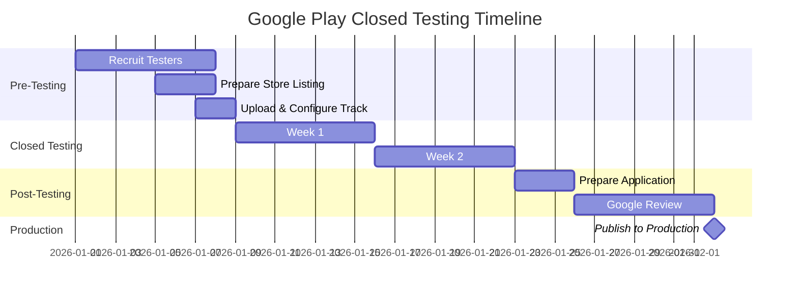

# 14 Days Closed Testing Timeline -- Day-by-Day Guide for Google Play

<p align="center">
  <a href="./README.md"></a>
  <a href="./BEST_PRACTICES.md"></a>
  <a href="./TROUBLESHOOTING.md"></a>
</p>

---

## Table of Contents

- [Overview](#overview)
- [Pre-Testing Phase (Days -7 to -1)](#pre-testing-phase-days--7-to--1)
- [Week 1: Launch and Early Monitoring (Days 1-7)](#week-1-launch-and-early-monitoring-days-1-7)
- [Week 2: Sustained Engagement (Days 8-14)](#week-2-sustained-engagement-days-8-14)
- [Post-Testing: Application Preparation (Days 15-17)](#post-testing-application-preparation-days-15-17)
- [Application and Review (Days 17+)](#application-and-review-days-17)
- [Full Timeline Summary](#full-timeline-summary)
- [Timeline Variations](#timeline-variations)

---

## Overview

The 14-day closed testing period is the heart of Google Play's production access requirement. This timeline breaks down exactly what you should do each day to maximize your chances of approval. Following a structured plan prevents the common mistakes that lead to rejection: disengaged testers, unaddressed crashes, and rushed applications.

This timeline assumes you have already:
- Created your Google Play Console account
- Built your app to a testable state
- Recruited at least 15 testers
- Set up your Google Group or tester list
- Prepared your store listing materials

If you have not completed these prerequisites, see [CHECKLIST.md](./CHECKLIST.md) first.

---

## Pre-Testing Phase (Days -7 to -1)

### Day -7: Finalize Your Tester List

- Confirm all 15+ tester email addresses are correct
- Create or verify your Google Group at groups.google.com
- Add all testers to the group
- Prepare your welcome message and testing guide

### Day -5: Prepare Your Store Listing

- Upload app icon, feature graphic, and screenshots to Play Console
- Write and review your app description
- Complete the content rating questionnaire
- Publish your privacy policy at its final URL
- Complete the Data Safety section

### Day -3: Upload and Configure

- Upload your App Bundle (.aab) to the closed testing track
- Configure country availability
- Add your Google Group email to the tester list
- Review all settings before starting rollout

### Day -2: Start Rollout and Send Pre-Launch Message

- Click **Start rollout** on your closed testing track
- Wait for Google's review to complete (1-3 hours typically)
- Once live, send a pre-launch message to testers:
  - Explain what the app does
  - Share the testing schedule (14 days)
  - Tell them to expect an invitation email from Google Play
  - Provide your contact information for questions

### Day -1: Verify Invitations

- Confirm all testers received the Google Play invitation email
- Help any testers who did not receive it (check spam, verify email)
- Remind testers to accept the invitation and install the app
- Note any testers who are unresponsive -- activate backup testers if needed

---

## Week 1: Launch and Early Monitoring (Days 1-7)

### Day 1: Official Start

**Morning:**
- Verify that your closed testing track shows as live in Play Console
- Check the testing dashboard for the first installs
- Send your welcome/testing guide message to all testers

**Evening:**
- Check installation count in Play Console
- Check crash reports (Quality > Android vitals > Crashes)
- Respond to any immediate tester questions

**Goal for Day 1**: 10+ testers installed and opened the app.

### Day 2: Early Feedback Collection

- Check daily install and crash metrics
- Send a quick check-in message: "How did your first day go? Any issues installing or using the app?"
- Address any installation problems immediately
- Note all feedback in your feedback log

### Day 3: First Engagement Push

- Review crash data for patterns
- If crash rate is above 1%, prioritize fixing before the weekend
- Send a specific feedback request: "Please try [specific feature] today and let me know if it works as expected"
- Follow up individually with any testers who have not opened the app

### Day 4: Stability Check

- Review crash data for the first 72 hours
- If crashes are present, begin working on fixes
- Check ANR rate (Quality > Android vitals > ANRs)
- Send a brief update to testers about any fixes you are working on

### Day 5: Feature-Specific Feedback

- Ask testers to focus on a different feature than Day 3
- Check if engagement is consistent across testers
- Identify your most and least engaged testers
- Personally thank your most active testers

### Day 6: Weekend Preparation

- Ensure your app handles any weekend-specific scenarios
- Send a reminder that testing continues through the weekend
- Share any interesting findings or fixes with the group
- If you have a bug fix ready, publish the update (review will take 1-3 hours)

### Day 7: Mid-Point Review

**This is a critical checkpoint. Assess honestly:**

| Metric | Target | Your Status |
|--------|--------|-------------|
| Active testers | 12+ | ___ |
| Crash rate | Below 1% | ___ |
| ANR rate | Below 0.47% | ___ |
| Feedback received | From 50%+ of testers | ___ |
| Bugs fixed | All critical bugs | ___ |

**Send a mid-point message to testers:**
```
We have reached the halfway point of testing! Thank you for your help so far.

Here is what I have learned:
- [Share 1-2 interesting findings]
- [Mention any bugs that were fixed]

For the second week, I would love your feedback on:
- [Specific feature or flow to test]

Thank you for sticking with this -- your feedback is making the app better.
```

**If below 12 active testers**: Activate backup testers immediately. Extend the testing period if needed.

---

## Week 2: Sustained Engagement (Days 8-14)

### Day 8: Fresh Start

- Review any feedback from the weekend
- Check crash and ANR metrics
- Send a new challenge or focus area for the week
- Address any backlog of tester questions

### Day 9: Deep Dive Testing

- Ask testers to try edge cases: "Try using the app with airplane mode on" or "Try rapidly switching between screens"
- Review crash reports for any new issues
- Continue fixing bugs as they are identified

### Day 10: Feedback Synthesis

- Review all feedback collected so far
- Identify themes: what do multiple testers mention?
- Prioritize remaining fixes
- Send a summary to testers: "Here is what I have heard from everyone so far..."

### Day 11: Pre-Final Engagement Push

- Encourage testers to use the app one more time
- Ask for any final thoughts or suggestions
- Check that 12+ testers remain active
- Begin organizing your feedback log for the production access application

### Day 12: Stability Verification

- Final review of crash and ANR data
- Confirm all critical issues are resolved
- Verify store listing is complete and accurate
- Begin drafting your production access application answers

### Day 13: Final Feedback Request

**Send the final feedback request:**
```
We are approaching the end of our 14-day testing period. Thank you so much for your help!

I have one final ask: could you take 5 minutes today to:
1. Open the app and use your favorite feature
2. Tell me one thing you like and one thing you would improve
3. Report any last issues you encounter

Your feedback has been incredibly valuable. I will share the results after the testing period ends.
```

### Day 14: Testing Period Complete

- Send a thank-you message to all testers
- Share what you learned and what you plan to change
- Let testers know they can uninstall the app if they wish (or keep it if you plan to continue testing)
- Take screenshots of your testing dashboard for your records
- **Do NOT apply for production access today.** Wait 2-3 additional days as a safety buffer.

---

## Post-Testing: Application Preparation (Days 15-17)

### Day 15: Data Collection

- Export or screenshot all relevant metrics from Play Console
- Finalize your feedback log with all tester comments organized by theme
- Create your "changes made" list based on feedback

### Day 16: Application Draft

Write your production access application with specific details:

**Testing Process:**
```
We recruited 15 testers through [method]. Testers were organized in a Google Group
and communicated via [channel]. Testing ran for 14 consecutive days from [date] to [date].
[Number] testers remained actively engaged throughout, opening the app an average of
[number] times each.
```

**Feedback Received:**
```
Key feedback themes included:
1. [Theme 1] - mentioned by [number] testers
2. [Theme 2] - mentioned by [number] testers
3. [Theme 3] - mentioned by [number] testers
```

**Changes Made:**
```
Based on tester feedback, we made the following changes:
1. [Change 1] - addressed feedback about [issue]
2. [Change 2] - requested by [number] testers
3. [Change 3] - fixed crash affecting [scenario]
```

### Day 17: Final Review

- Verify the production access dashboard shows all requirements as met
- Review your application answers for completeness and accuracy
- Have someone else read your application for clarity
- Confirm no changes are needed to your app
- If everything checks out, submit the application

---

## Application and Review (Days 17+)

### Days 17-24: Review Period

- Google typically takes 3-7 business days to review
- Monitor your email and Play Console for any follow-up questions
- Respond promptly if Google requests additional information
- Do not make changes to your app during review

### If Approved (Day ~21-24)

- Navigate to **Production** in Play Console
- Create your production release
- Upload the same App Bundle (or an updated version)
- Submit for standard app review
- Your app goes live after review (typically a few hours)

### If Rejected

See [COMMON_REJECTIONS.md](./COMMON_REJECTIONS.md) for detailed guidance.

---

## Full Timeline Summary



---

## Timeline Variations

### Accelerated Timeline (Testers Ready on Day 1)

If you already have 15+ testers lined up and your app is production-ready:

| Phase | Duration |
|-------|----------|
| Track setup and rollout | 1 day |
| Google review of testing track | 1-3 hours |
| Closed testing | 14 days |
| Post-testing buffer | 2-3 days |
| Production access review | 3-7 days |
| **Total** | **~21 days** |

### Extended Timeline (Recruitment During Testing)

If you are still recruiting testers when testing begins:

| Phase | Duration |
|-------|----------|
| Initial tester recruitment | 1-2 weeks |
| Testing with partial testers | 1-2 weeks |
| Full 12+ testers engaged | 14 days |
| Post-testing + review | 5-10 days |
| **Total** | **6-8 weeks** |

### Rejection Recovery Timeline

If your first application is rejected:

| Phase | Duration |
|-------|----------|
| Review rejection reasons | 1-2 days |
| Address issues | 3-7 days |
| Additional testing (if needed) | 14 days |
| Reapplication + review | 3-7 days |
| **Total additional time** | **3-5 weeks** |

### Managed Timeline (Using a Tester Service)

If you use a service like [TesterBee](https://testerbee.com/12-testers-for-google-play) to handle tester recruitment and engagement:

| Phase | Duration |
|-------|----------|
| Service setup + tester matching | 1-2 days |
| Closed testing with managed testers | 14 days |
| Post-testing + review | 5-10 days |
| **Total** | **~21-26 days** |

This is often the fastest path for developers who do not have an existing tester network, as it eliminates the weeks typically spent on recruitment and tester management. [TesterBee](https://testerbee.com) specializes in providing real, engaged testers specifically for Google Play's closed testing requirement.

---

## Daily Checklist Card

Print or save this for quick reference during your testing period:

```
GOOGLE PLAY CLOSED TESTING -- DAILY CHECKLIST

[ ] Check install count (Testing > Closed testing)
[ ] Check crash rate (Quality > Android vitals > Crashes)
[ ] Check ANR rate (Quality > Android vitals > ANRs)
[ ] Review new tester feedback
[ ] Respond to tester questions
[ ] Update feedback log
[ ] Fix critical bugs if found
[ ] Send tester communication (per schedule)

CRITICAL THRESHOLDS:
- Active testers: Must be 12+
- Crash rate: Must be below 1%
- ANR rate: Must be below 0.47%
```

---

<p align="center">
  <a href="./README.md">Home</a> |
  <a href="./REQUIREMENTS.md">Requirements</a> |
  <a href="./CHECKLIST.md">Checklist</a> |
  <a href="./BEST_PRACTICES.md">Best Practices</a> |
  <a href="./TROUBLESHOOTING.md">Troubleshooting</a> |
  <a href="./RESOURCES.md">Resources</a>
</p>
